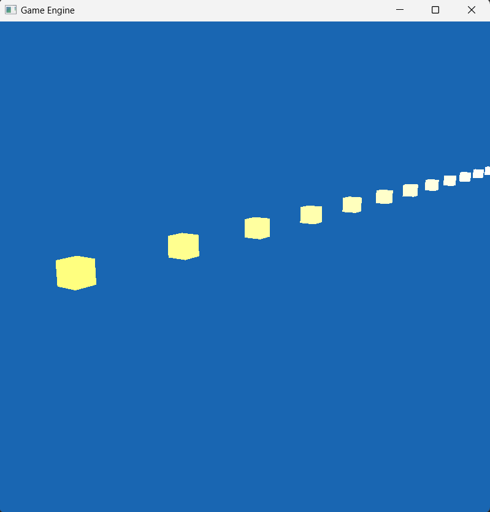
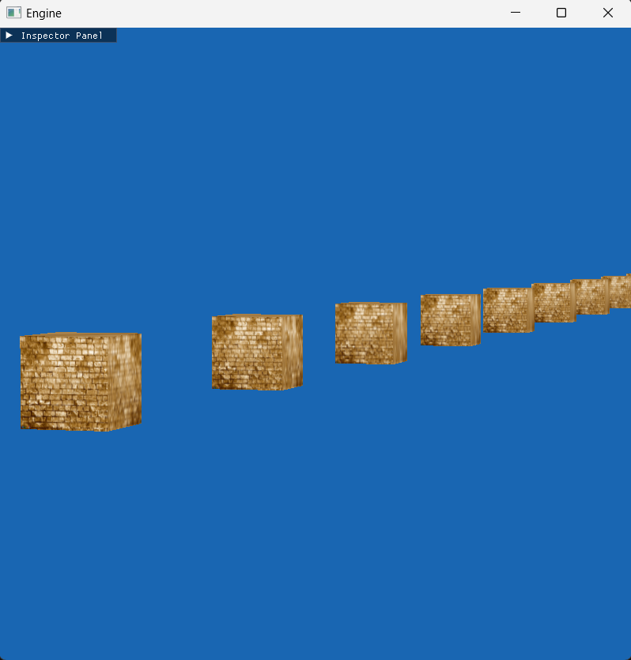
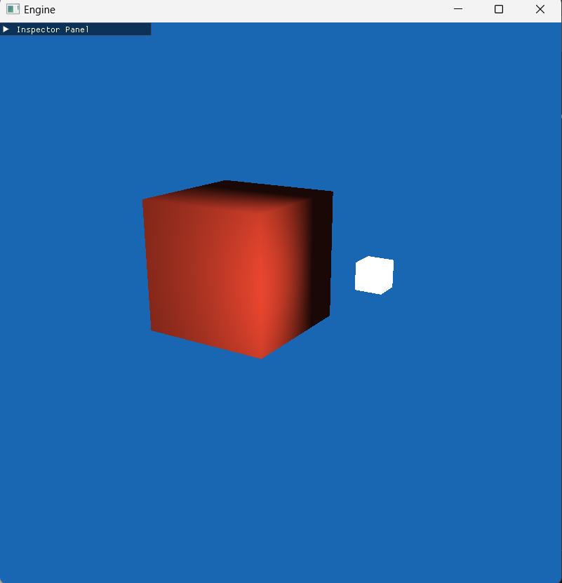

# BUILDING THE PROJECT
<pre>
build & build-cmake files are included
    .sh  extension is for linux
    .bat extension is for windows

only build-cmake.bat works correctly
</pre>

# Follow the progress : 
  https://trello.com/b/8og3yTb4/engine

