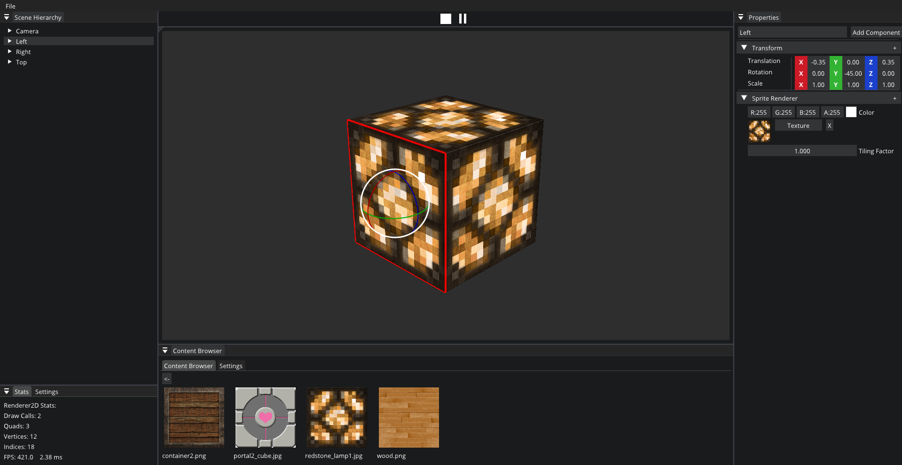
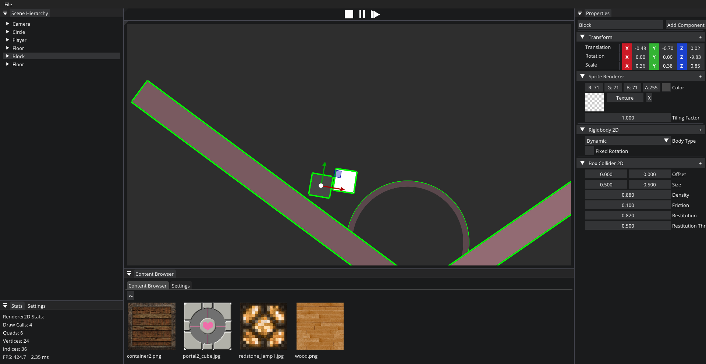

# Qbit

Qbit is a lightweight game engine designed for learning purposes. It's built with a mission to achieve high performance, modularity, readability, and memory safety. Qbit aims to provide a clear and structured codebase for understanding game engine development concepts.

## Build Instructions

### Windows:

1. Run `CreateSolution.bat` to generate the Visual Studio Solution.
2. After running the script:
    - Open `Qbit.sln`
    - Run the project.

### Linux:

1. Run `build-glfw.sh` to compile GLFW.
2. Run `build-glew.sh` to compile GLEW.
3. Run `build-cmake.sh` to build the project.

## Project Structure

Qbit's project structure is designed to promote clarity and organization:

- **Engine**: The core library of the engine, containing essential components and functionalities.
- **Editor**: Provides the editor layer of the engine.
- **src**: Contains the source code of the engine.
- **vendor**: Third-party dependencies are stored here.
- **Sandbox**: Provides a sandbox application for testing the engine.

## Features

- **High Performance**: Qbit is optimized for performance, ensuring smooth gameplay experiences.
- **High Modularity**: The engine is divided into modules, allowing for easy extension and customization.
- **High Readability**: Codebase is structured and documented for readability, facilitating comprehension and collaboration.
- **Memory Safety**: Qbit prioritizes memory safety to prevent common programming errors and improve stability.

## Follow the progress : [Trello](https://trello.com/b/8og3yTb4/engine)

