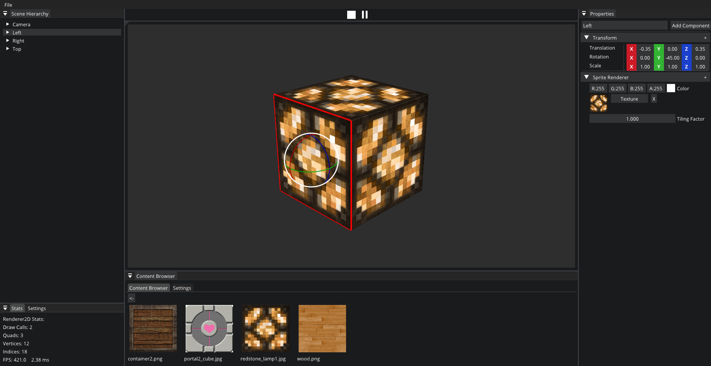
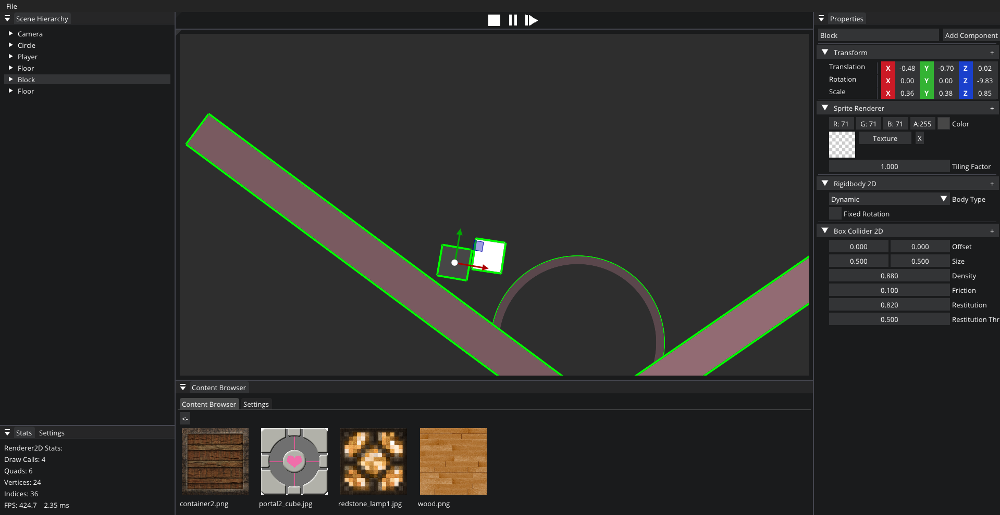

# Qbit 

Qbit is a lightweight game engine. It's built with a mission to achieve high performance, modularity, readability, and memory safety. Qbit aims to provide a clear and structured codebase for understanding game engine development concepts.

## Dependencies

**VulkanSDK**: To build Qbit from source you need VulkanSDK installed.

## Build Instructions

### Windows:

1. Run `Setup.bat` to build 3rd party libraries.
2. Run `CreateSolution.bat` or `CreateSolutionBuild.bat` to generate the Visual Studio Solution in root or build directory.
3. After running the script:
    - Open `Qbit.sln`
    - Run the project.

## Follow the progress : [Trello](https://trello.com/b/8og3yTb4/engine)

