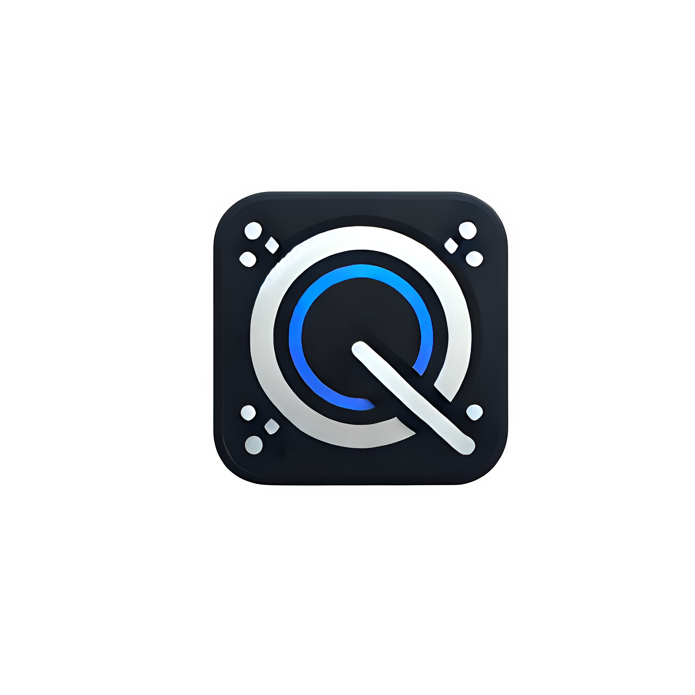

# Qbit 

  

Qbit is a **cross-platform**, **open-source** game engine designed to create high performance 2D and 3D games. It supports the full game development pipeline—rendering, physics, input handling, asset management and distributing the game executable.

## Documentation
- [About Qbit](docs/manual/AboutQbit.md)

## Development
- [Build Instructions](BUILDING.md)
- [Contributing Guidelines](CONTRIBUTING.md)

## LICENSE
Qbit as a whole is open-source software and licensed under the Apache 2.0 license.